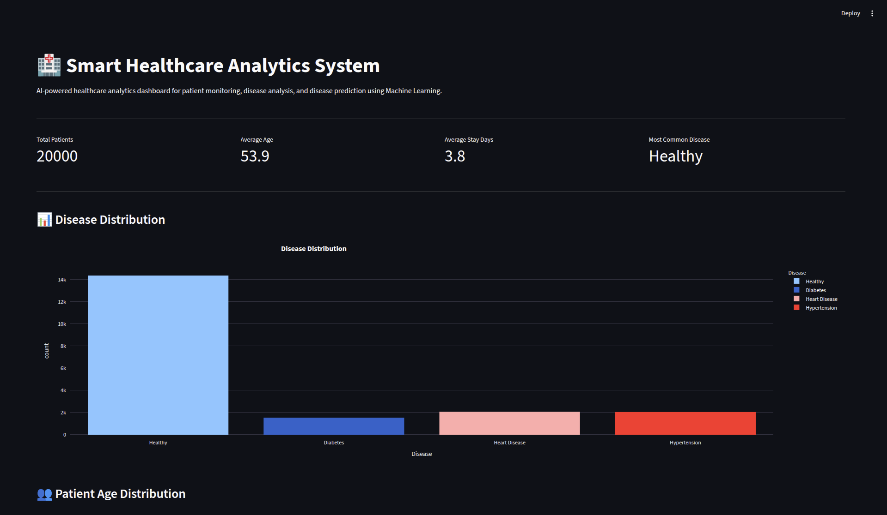
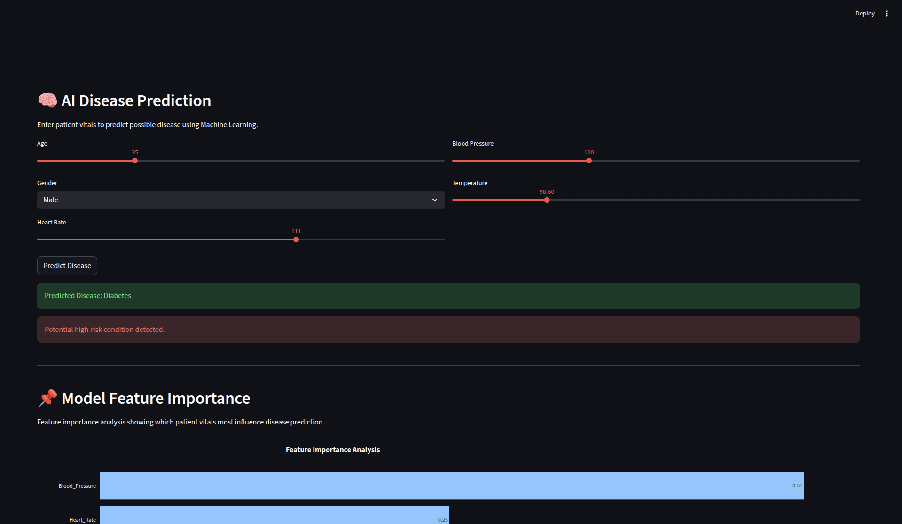
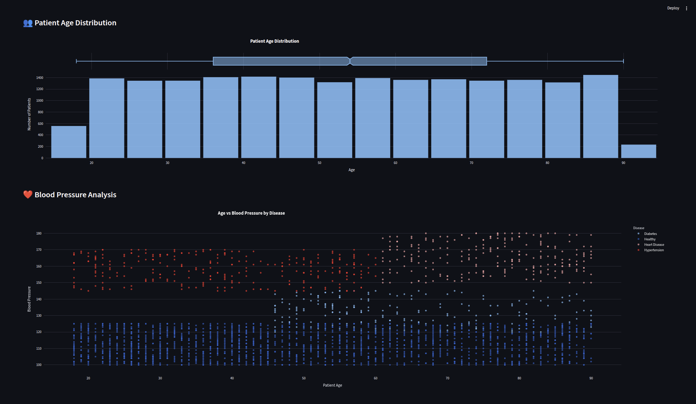

# 🏥 Smart Healthcare Analytics System

AI-powered healthcare analytics dashboard built using Machine Learning, Streamlit, and Plotly.

This system analyzes patient healthcare data, predicts diseases using AI, and provides interactive healthcare insights through modern visualizations.

---

# 🚀 Live Demo

🔗 Add your deployed Streamlit link here

Example:

https://your-app-name.streamlit.app

---

# 🚀 Features

✅ AI Disease Prediction using Machine Learning  
✅ Interactive Healthcare Analytics Dashboard  
✅ Disease Distribution Analysis  
✅ Blood Pressure & Patient Health Insights  
✅ Feature Importance Visualization  
✅ Hospital Stay Analytics  
✅ Realistic Synthetic Healthcare Dataset (20,000+ records)  
✅ Streamlit Web Application  

---

# 🧠 Machine Learning Model

- Model Used: Random Forest Classifier
- Accuracy Achieved: 99%
- Dataset Size: 20,000+ healthcare records

### Features Used:
- Age
- Gender
- Heart Rate
- Blood Pressure
- Temperature

### Diseases Predicted:
- Healthy
- Hypertension
- Heart Disease
- Diabetes
- Flu
- Asthma

---

# 📊 Dashboard Analytics

The dashboard provides:

- Disease distribution analysis
- Patient demographic insights
- Blood pressure analytics
- Hospital stay analysis
- AI-powered disease prediction
- Feature importance analysis

---

# 🛠️ Tech Stack

### Frontend & Dashboard
- Streamlit
- Plotly

### Machine Learning
- Scikit-learn
- Random Forest Classifier

### Data Processing
- Pandas
- NumPy

### Dataset Generation
- Faker

---

# 📂 Project Structure

```bash
Smart-Healthcare-Analytics-System/
│
├── app.py
├── requirements.txt
├── README.md
│
├── data/
│   └── patient_data.csv
│
├── models/
│   ├── disease_prediction_model.pkl
│   ├── gender_encoder.pkl
│   ├── disease_encoder.pkl
│   └── train_model.py
│
├── screenshots/
│   ├── dashboard.png
│   ├── prediction.png
│   └── analytics.png
│
└── generate_data.py
```

---

# 📸 Screenshots

## 🏠 Main Dashboard



---

## 🧠 AI Disease Prediction



---

## 📊 Analytics & Feature Importance



---

# ▶️ Installation & Setup

## 1️⃣ Clone Repository

```bash
git clone https://github.com/your-username/Smart-Healthcare-Analytics-System.git
```

---

## 2️⃣ Navigate to Project Folder

```bash
cd Smart-Healthcare-Analytics-System
```

---

## 3️⃣ Install Dependencies

```bash
pip install -r requirements.txt
```

---

## 4️⃣ Run Application

```bash
streamlit run app.py
```

---

# 🧪 Generate Dataset

To generate synthetic healthcare dataset:

```bash
python generate_data.py
```

---

# 🤖 Train Machine Learning Model

```bash
python models/train_model.py
```

---

# 🌐 Deployment

This application is deployed using Streamlit Community Cloud.

---

# 📌 Future Improvements

- SQL Database Integration
- User Authentication
- Doctor Dashboard
- Real-time Patient Monitoring
- Deep Learning Model Integration
- Cloud Deployment on AWS/Azure

---

# 👨‍💻 Author

## Soham Kadam

Built using Machine Learning, Healthcare Analytics, and Streamlit.


